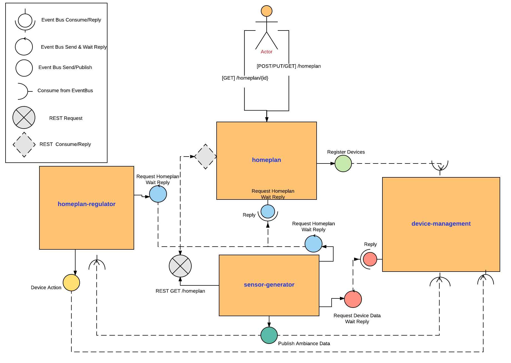
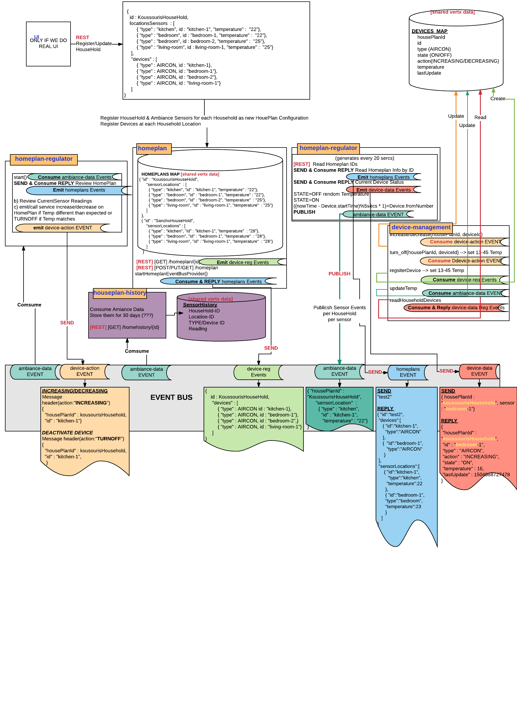

= SCENARIO

 

== The Micro-Homeplan Application

This is a short description of the scenario we will be working throughout the labs

It’s going to be a fake home appliance IOT management app, where we will be able to regulate the temperature in different rooms at our home. The application is composed of a set of microservices:

* The *_homeplan_* - this is a service which allows home owners to register and review their homeplan providing the temperature in each of the rooms in their house and the heat regulating applicances in each room. 

* The *_device management_* - this is a component which receives registration and update requests on the devices.

*  The *_sensor generator_* - this is a ficticious service emitting every 20 secs an event indicating the room temperature dependent on the state of the heating device (ON/OFF and INCREASING/DECREASING temperature)

* The *_homeplan regulator_* - this is a service which reads our current homeplan and based on the emmitted temperature in the room it regulates the action a device has to take to enforece the plan ie. INCREASE, DECREASE temperature of TURNOFF the device.

== Design
 

== Target

* AUTONOMOUS : CHECK
* ASYNCHRONOUS: CHECK
* ELASTIC: CHECK
* RESILIENT: CHECK

= LAB 5

TIME ESTIMATION 30 MINUTES
FOLLOWED by 15 MINUTES reviewing the solution

== Concepts visited in this LAB

* https://maven.fabric8.io/[fabric8-maven-plugin]
* Build & Deploy on Openshift
* http://vertx.io/docs/vertx-service-discovery-bridge-kubernetes/java/[Vert.x service discovery on OCP (KubernetesBridge)]
* Vert.x Elasticity and Resillience

== PARTICIPANTS

==== STEP 1 - Start local openshift or connect to 'remote Openshift'
    * *Option 1:* Start local openshift with *_'oc tools'_* using the following command (all commands as root or sudo user)
         
----
oc cluster up
----
    * Create project

----
oc new-project workshop
----
   
    * Login into that project so f8 plugin will be able to use this user

----
oc login -u developer -p developer (NOTE*** those are default user/pass, put yours.. )
----

    * We are going to use kubernetes discovery for clustering Vert.x node instances and for that we will require some privileges in the service account used when running the container (default sa in our case):  
----
oc policy add-role-to-user view system:serviceaccount:$(oc project -q):default -n $(oc project -q)
----

    * *Option 2:* Connect to remote Openshift cluster

----
oc MASTER-NODE-IP:8443 login -u YOURNAME -P YOURPASSWORD
oc project YOUR-PROJECT-NAMESPACE
----

The above will be determined if an online environment is provided

==== STEP 2 - Prepare maven projects for Openshift
* clone/unzip https://github.com/skoussou/vertx-reactive-workshop Branch *LAB 5*
* Add fabric8 plugin in project by running this maven command in order to enable Openshift deployments via maven commands (do so only for the *_homeplan_* maven project the others are already prepared) 

----
mvn io.fabric8:fabric8-maven-plugin:3.5.25:setup
----

* Add libraries in pom.xml in order to provide Vert.x API for discovery of services on Openshift (do so only for the *_homeplan_* maven project the others are already prepared) 

----
	   <dependency>
	     <groupId>io.vertx</groupId>
	     <artifactId>vertx-service-discovery-bridge-kubernetes</artifactId>
	   </dependency>
            <!-- required by  vertx-service-discovery-bridge-kubernetes -->
	   <dependency>
	     <groupId>org.slf4j</groupId>
	     <artifactId>slf4j-api</artifactId>
	     <version>1.7.21</version>
	   </dependency>
----

* Add f8 property in pom.xml (between <properties>.....</properties> for image base during image creation with the codebase(do so only for the *_homeplan_* maven project the others are already prepared)

----
    <!-- F8 configuration -->
     <fabric8.generator.from>registry.access.redhat.com/redhat-openjdk-18/openjdk18-openshift</fabric8.generator.from>
----

* Create *_src/main/fabric8_* folder in project and add *_deployment.yml_* file from link:https://github.com/skoussou/vertx-reactive-workshop/tree/LAB-5//openshift[openshift]  (do so only for the *_homeplan_* maven project the others are already prepared)
* Create package called *_openshift under_* *_src/main/resources_* and add *_cluster-config.xmll_* file from link:https://github.com/skoussou/vertx-reactive-workshop/tree/LAB-5//openshift[openshift]  (do so only for the *_homeplan_* maven project the others are already prepared)  
* Package microservice and deploy using f8 plugin (Note: in case of local Openshift cluster and if internet connection is slow pulling via docker command the image first into your local registry migth help for this step not to fail). If you need at any point to remove *_workshop_* applications use link:https://github.com/skoussou/vertx-reactive-workshop/tree/LAB-5/scripts/purge_apps.sh[purge_apps.sh]

----
mvn package fabric8:deploy -Dfabric8.mode=openshift
----

* Test 
   ** *_oc get -w pods_* and note the POD IDs of the PODS which are running the microservices
   ** *_oc logs -f POD_ID_* for each POD and check that the cluster has been successfully created
* Run the following test

----
curl -d "@test3.json" -X POST http://homeplan-workshop.192.168.1.4.xip.io/homeplan/test3
----

  ** There is an error in *_sensor-generator_* because discovery in OCP is not based on HOST_NAME any longer but on service name (remember all PODs are in the same namespace/project 'workshop')
  ** Fix the error by implementing Openshift service discover of the *_homeplan_* service via Kubernetes. https://github.com/vert-x3/vertx-examples/blob/master/openshift3-examples/service-discovery-application/http-frontend/src/main/java/io/vertx/examples/openshift/MyHttpVerticle.java[Here is a good example]

==== STEP 3 - Scale Vert.x instances (Elasticity & Resillience
* Scale HomePlan POD (Loadbalancing)
* Scale HomePlan Regulator using OC Commands (eg. Sensor Generator messages consumed by multiple HomePlan Regulaotrs or ONLY one??)

