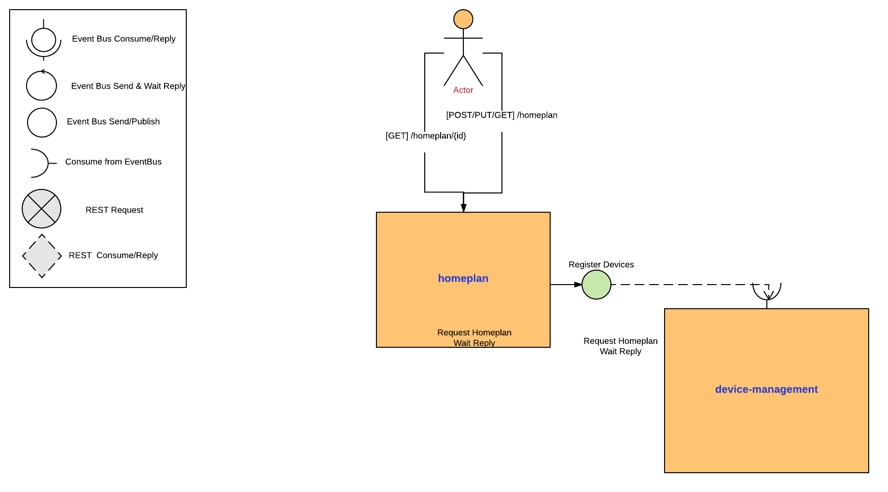

= SCENARIO

image:images/Visual-Scenario.png["VertX Application Scenario",height=712] 

== The Micro-Homeplan Application

This is a short description of the scenario we will be working throughout the labs

It’s going to be a fake home appliance IOT management app, where we will be able to regulate the temperature in different rooms at our home. The application is composed of a set of microservices:

* The *_homeplan_* - this is a service which allows home owners to register and review their homeplan providing the temperature in each of the rooms in their house and the heat regulating applicances in each room. 

* The *_device management_* - this is a component which receives registration and update requests on the devices.

*  The *_sensor generator_* - this is a ficticious service emitting every 20 secs an event indicating the room temperature dependent on the state of the heating device (ON/OFF and INCREASING/DECREASING temperature)

* The *_homeplan regulator_* - this is a service which reads our current homeplan and based on the emmitted temperature in the room it regulates the action a device has to take to enforece the plan ie. INCREASE, DECREASE temperature of TURNOFF the device.

== Design
image:images/design.png["VertX Application",height=356]

= LAB 2

TIME ESTIMATION 30 MINUTES
FOLLOWED by 15 MINUTES reviewing the solution

== Concepts visited in this LAB

* http://vertx.io/docs/vertx-core/java/#event_bus[The EventBus] sending/consuming messages over a clustered bus
* Clustering and http://vertx.io/docs/vertx-core/java/#_using_shared_data_with_vert_x[Shared Data on Vert.x] on clustered Vert.x intances

== PARTICIPANTS

In this lab we will extend the capabilities to add a new maven project (*_device-management_*) which will handle requests over the Vert.x EventBus to register the devices. You will send & consume messages sent to an EventBus address for the registration purpose and also save the devices into a clustered map maintained by Vert.x clustered nodes.

 

==== STEP 1 - Start a clustered Vert.x application
* clone/unzip https://github.com/skoussou/vertx-reactive-workshop Branch *LAB 2*
* Run the following command to initiate a clustered Vert.X application and you should see the relevant message to indicate clustering has taken place with 2 members

----
open new terminal
cd [REPOSITORY CLONED DIR - Branch LAB-2]/homeplan
mvn compile vertx:run -Dvertx.runArgs="-cluster -Djava.net.preferIPv4Stack=true"

open new terminal
cd [REPOSITORY CLONED DIR - Branch LAB-2]/device-management
mvn compile vertx:run -Dvertx.runArgs="-cluster -Djava.net.preferIPv4Stack=true"
----

* (optional) Read on Vert.x link:http://vertx.io/docs/#clustering[clustering] and note we have used http://vertx.io/docs/vertx-hazelcast/java/[Hazlecast clustering configuration] therefore check the pom.xml and resources/cluster-config.xml

==== STEP 2 - Create content for the following parts of the scenario
* Create Content for verticles in *_homeplan_* maven project to complete the service
  ** Using resources at link:http://vertx.io/docs/vertx-core/java/#event_bus[Vert.x EventBus] Fix method *_sendDevicesRegistration(FullHomePlanDTO fullHomePlanDto)_* to *_send_* Messages to *_#device-reg_* on the bus
    *** Test by executing the following request and check the console of the *_homeplan_* Vert.x application for output showing the registration taking place. 
    
----
open new terminal
cd [REPOSITORY CLONED DIR - Branch LAB-2]/homeplan
mvn compile vertx:run  -Dvertx.runArgs="-cluster -Djava.net.preferIPv4Stack=true"

open new terminal
cd [REPOSITORY CLONED DIR - Branch LAB-2]/device-management
mvn compile vertx:run  -Dvertx.runArgs="-cluster -Djava.net.preferIPv4Stack=true"

open new terminal
cd [REPOSITORY CLONED DIR - Branch LAB-2]/homeplan/data
curl -H "Content-Type: application/json" -X POST -d '@test3.json'  http://127.0.0.1:8080/homeplan/test3
----

Did your test success? If so, continue with next part of the lab. If you got an "Internal Error" as response.. Are you properly encoding your message as String? Add this to the message => Json.encode(message). In this lab, we are just using Strings as messages, so there is not any additional codec type used.

* Create Content for verticles in *_device-management_* maven project to complete the service
  ** Using resources at link:http://vertx.io/docs/vertx-core/java/#event_bus[Vert.x EventBus] Fix method *_registerDevices_* to *_consume_* Messages from *_#device-reg_* EventBus address and complete register Device action
    *** Test by executing the following request and check the console of the device-management Verticle for output *_Handler for adding Device ["DEVICE CONTENT"] is missing. You need to complete it_*

----
open new terminal
cd [REPOSITORY CLONED DIR - Branch LAB-2]/homeplan
mvn compile vertx:run  -Dvertx.runArgs="-cluster -Djava.net.preferIPv4Stack=true"

open new terminal
cd [REPOSITORY CLONED DIR - Branch LAB-2]/device-management
mvn compile vertx:run  -Dvertx.runArgs="-cluster -Djava.net.preferIPv4Stack=true"

open new terminal
cd [REPOSITORY CLONED DIR - Branch LAB-2]/homeplan/data
curl -H "Content-Type: application/json" -X POST -d '@test3.json'  http://127.0.0.1:8080/homeplan/test3
----

  ** Using resources at link:http://vertx.io/docs/vertx-core/java/#_using_shared_data_with_vert_x[Shared Data on Vert.x] Fix method *_registerDevice_* and PUT the devices into a shared-map
    ** Use the above test and now each device should be showing as registered in the logs

