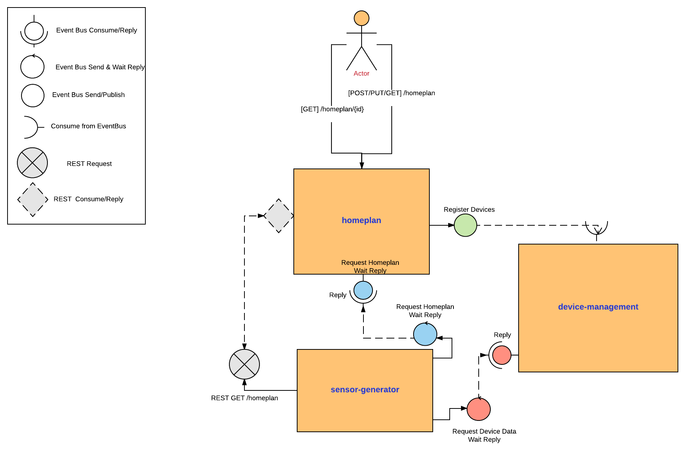

= SCENARIO

image:images/Visual-Scenario.png["VertX Application Scenario",height=712] 

== The Micro-Homeplan Application

This is a short description of the scenario we will be working throughout the labs

It’s going to be a fake home appliance IOT management app, where we will be able to regulate the temperature in different rooms at our home. The application is composed of a set of microservices:

* The *_homeplan_* - this is a service which allows home owners to register and review their homeplan providing the temperature in each of the rooms in their house and the heat regulating applicances in each room. 

* The *_device management_* - this is a component which receives registration and update requests on the devices.

*  The *_sensor generator_* - this is a ficticious service emitting every 20 secs an event indicating the room temperature dependent on the state of the heating device (ON/OFF and INCREASING/DECREASING temperature)

* The *_homeplan regulator_* - this is a service which reads our current homeplan and based on the emmitted temperature in the room it regulates the action a device has to take to enforece the plan ie. INCREASE, DECREASE temperature of TURNOFF the device.

== Design
image:images/design.png["VertX Application",height=356]

= LAB 3

TIME ESTIMATION 30 MINUTES
FOLLOWED by 15 MINUTES reviewing the solution

== Concepts visited in this LAB

* http://vertx.io/docs/vertx-core/java/#event_bus[The EventBus] sending/consuming messages over a clustered bus with SEND/REPLY pattern
* Vert.x Reacting via handlers
* Vert.x Reacting via Futures
* http://vertx.io/docs/vertx-web-client/java/[HTTP Rest Client]

== PARTICIPANTS

In this lab, we further enhance our applications so that a new *_sensor-generator_* Vert.x application is added. This new app will generate for every registered homeplan a "random" temperature for each of the rooms (sensorLocations) registered. Basically, it will take into account the previous temperature, if the AIRCON is on/off and if it is set to INCREASE/DECREASE the room temeperature. 
*_Device-management_* offers a service SEND/REPLY to read a specific device status available as a SEND/REPLY EventBus service.
*_Homeplan_* offers a service SEND/REPLY to read a specific homeplan as a SEND/REPLY EventBus service.

 

==== STEP 1 - Start a clustered Vert.x application
* clone/unzip https://github.com/skoussou/vertx-reactive-workshop Branch *LAB 3*
* Run the following command to initiate a clustered Vert.X application and you should see the relevant message to indicate clustering has taken place with 3 members

----
open new terminal
cd [REPOSITORY CLONED DIR - Branch LAB-3]/homeplan
mvn compile vertx:run -Dvertx.runArgs="-cluster -Djava.net.preferIPv4Stack=true"

open new terminal
cd [REPOSITORY CLONED DIR - Branch LAB-3]/device-management
mvn compile vertx:run -Dvertx.runArgs="-cluster -Djava.net.preferIPv4Stack=true"

open new terminal
cd [REPOSITORY CLONED DIR - Branch LAB-3]/sensor-generator
mvn compile vertx:run -Dvertx.runArgs="-cluster -Djava.net.preferIPv4Stack=true"
----

==== STEP 2 - Create content for the following parts of the scenario
* Create Content for verticles in *_sensor-generator_* maven project to complete the service
  ** Using resources at http://vertx.io/docs/vertx-web-client/java/[Web Client] Fix method *_getHomePlanIds()_* to make RESTful *GET* call to endpoint */homeplan* to retrieve the *ids* of the registred homeplans. Hint: http://vertx.io/docs/vertx-web-client/java/#_handling_http_responses[Handling http responses]
    *** Test the added functionality by executing the request below and checking on the *_sensor-generator_* Vert.x application for the output showing the received homeplan Ids and that the message has been changed _"INFO: FIXME - Getting all homeplans ids"_ for another _"INFO: FIXME - Sending event to address homeplans to get homeplan details for id test3"_ (the same can also be inspected at the *_homeplan_* Vert.x applicatoin console which is serving the request)
  ** Using resources at link:http://vertx.io/docs/vertx-core/java/#_the_theory[Vert.x EventBus] around SEND/REPLY pattern Fix method *_getHomePlan()_* to send the given homeplan id to address *_#homeplan_* and expect a reply of the HomePlanDTO corresponding to this ID
    *** To test upon saving redeployment you should see in the *_homeplan_* Vert.x application console log the following message _"INFO FIXME - NO #homeplan address REPLY - Replied to message successfully"_. This will disappear further down in the lab when we implement _replyWithHomeplan(Message<String> message)_*
  ** Using resources at link:http://vertx.io/docs/vertx-core/java/#_the_theory[Vert.x EventBus] around SEND/REPLY pattern Fix method *_getDeviceStatus()_* to send the given sensor id to address *_#device-data_* and expect a reply of the DeviceStatusDTO corresponding to this ID
    *** To test upon saving redeployment you should get the error since no REPLY on this addres has been implemented yet. This will be tested along the next part of the lab
----
open new terminal
cd [REPOSITORY CLONED DIR - Branch LAB-3]/homeplan
mvn compile vertx:run -Dvertx.runArgs="-cluster -Djava.net.preferIPv4Stack=true"

open new terminal
cd [REPOSITORY CLONED DIR - Branch LAB-3]/device-management
mvn compile vertx:run -Dvertx.runArgs="-cluster -Djava.net.preferIPv4Stack=true"

open new terminal
cd [REPOSITORY CLONED DIR - Branch LAB-3]/sensor-generator
mvn compile vertx:run -Dvertx.runArgs="-cluster -Djava.net.preferIPv4Stack=true"

open new terminal
cd [REPOSITORY CLONED DIR - Branch LAB-3]/homeplan/data
curl -H "Content-Type: application/json" -X POST -d '@test3.json'  http://127.0.0.1:8080/homeplan/test3
----

* Create Content for verticles in *_homeplan_* maven project to complete the service
  ** Using resources at link:http://vertx.io/docs/vertx-core/java/#event_bus[Vert.x EventBus] Fix method *_replyWithHomeplan(Message<String> message)_* to *_reply_* to a consumed request on *_#homeplans_* address on the bus with the identified homeplan details
    *** To test upon saving redeployment should give you the outcome desired in the *_homeplan_* and in *_sensor-generator_* console logs you will see a new message starting _"INFO: Homeplan returned:..."_

* Create Content for verticles in *_device-management_* maven project to complete the service
    ** Using resources at http://vertx.io/docs/vertx-core/java/#event_bus[Vert.x EventBus] Fix method *_replyDevice(String key, Message<String> message)_* to *_reply_* to a consumed request on *_#device-data_* address on the bus with the identified device details. Hint: Acknowledging messages / sending replies.
    *** To test upon saving redeployment should give you the outcome desired in the *_device-management_* and *_sensor-generator_* console logs and finally the ambiance data would have been created for the sensor location and message _"INFO: Publishing in address ambiance-data event..."_ appears

----
open new terminal
cd [REPOSITORY CLONED DIR - Branch LAB-2]/homeplan
mvn compile vertx:run  -Dvertx.runArgs="-cluster -Djava.net.preferIPv4Stack=true"

open new terminal
cd [REPOSITORY CLONED DIR - Branch LAB-2]/device-management
mvn compile vertx:run  -Dvertx.runArgs="-cluster -Djava.net.preferIPv4Stack=true"

open new terminal
cd [REPOSITORY CLONED DIR - Branch LAB-2]/homeplan/data
curl -H "Content-Type: application/json" -X POST -d '@test3.json'  http://127.0.0.1:8080/homeplan/test3
----

